# CozyCoffee 智能点单与会员运营系统

## 项目简介
CozyCoffee 是一个面向咖啡零售场景的微服务业务系统，覆盖用户认证、商品点单、订单履约、会员成长、积分权益、优惠券规则与运营后台。

项目定位：
- 面向真实业务链路的后端工程项目
- 强调高频查询性能、交易链路稳定性与规则系统落地
- 展示从需求实现到压测优化的完整闭环能力

## 核心亮点
- 微服务架构拆分：用户、会员、订单、商城、网关等服务按业务域解耦，基于 Dubbo + Nacos 完成 RPC 与服务发现
- 会员积分体系：实现双账户模型（EXP/积分）、等级成长、FIFO 扣减与权益发放
- Redis 深度应用：
  - String：菜单与运营数据缓存
  - Bitmap：签到日历与连续签到统计
  - ZSet：订单超时取消到期队列
- 稳定性治理：分布式锁、幂等防重、降级兜底、SCAN 分批失效清理
- 压测结果（Locust，500并发）：
  - 吞吐量提升 8.6%
  - 平均响应时间下降 19.61%
  - P99 延迟下降 16%
  - 0 失败请求

## 技术栈
- 后端：Java 17, Spring Boot, Dubbo, MyBatis-Plus
- 注册配置：Nacos
- 缓存：Redis
- 数据库：MySQL
- 前端：Vue3 + Vite（用户端/管理端）
- 压测：Locust

## 系统架构图
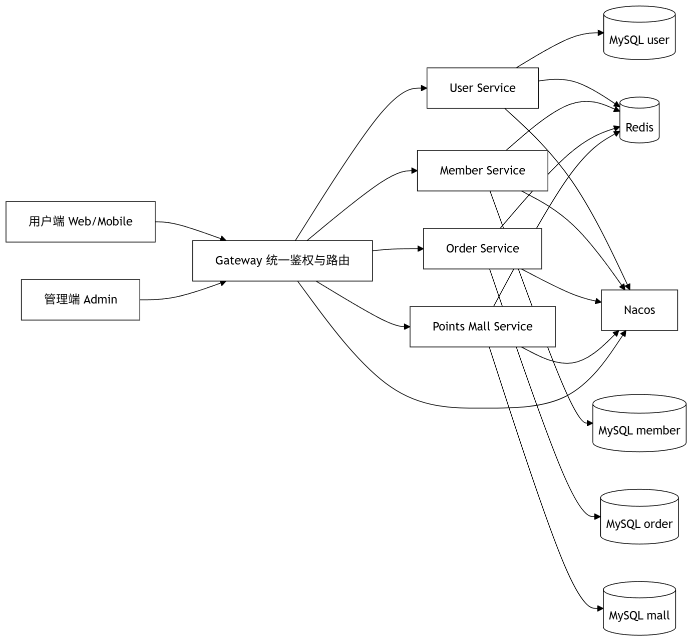

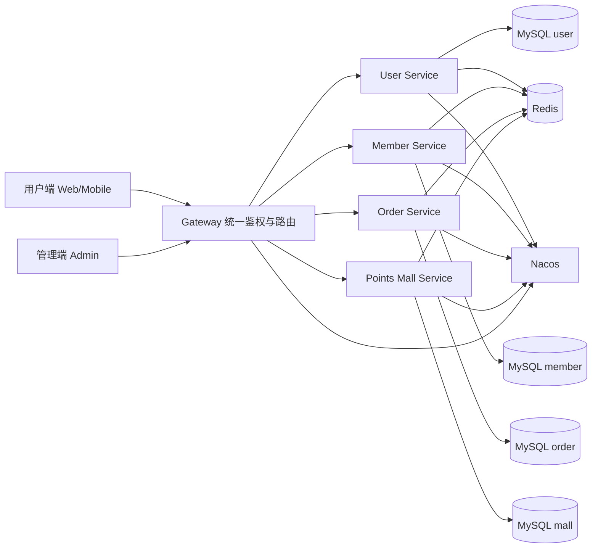
```mermaid
flowchart LR
    U[用户端 Web/Mobile] --> G[Gateway 统一鉴权与路由]
    A[管理端 Admin] --> G

    G --> US[User Service]
    G --> MS[Member Service]
    G --> OS[Order Service]
    G --> PS[Points Mall Service]

    US --> MYSQL1[(MySQL user)]
    MS --> MYSQL2[(MySQL member)]
    OS --> MYSQL3[(MySQL order)]
    PS --> MYSQL4[(MySQL mall)]

    US --> R[(Redis)]
    MS --> R
    OS --> R
    PS --> R

    US --> N[Nacos]
    MS --> N
    OS --> N
    PS --> N
    G --> N
```

## 下单时序图
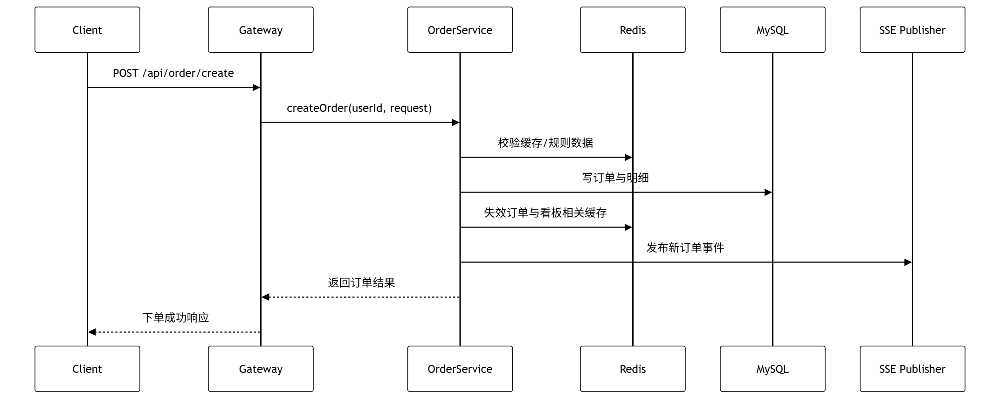

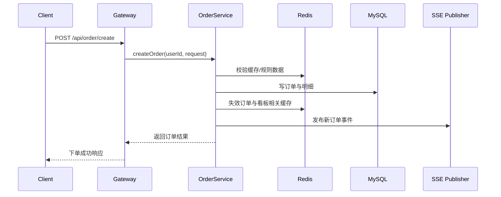
```mermaid
sequenceDiagram
    participant C as Client
    participant GW as Gateway
    participant OS as OrderService
    participant RS as Redis
    participant DB as MySQL
    participant SSE as SSE Publisher

    C->>GW: POST /api/order/create
    GW->>OS: createOrder(userId, request)
    OS->>RS: 校验缓存/规则数据
    OS->>DB: 写订单与明细
    OS->>RS: 失效订单与看板相关缓存
    OS->>SSE: 发布新订单事件
    OS-->>GW: 返回订单结果
    GW-->>C: 下单成功响应
```

## 缓存策略图

```mermaid
flowchart TD
    Q[请求菜单] --> L1{本地缓存命中?}
    L1 -- 是 --> RET1[直接返回]
    L1 -- 否 --> L2{Redis命中?}
    L2 -- 是 --> RET2[回填本地缓存并返回]
    L2 -- 否 --> LOCK{获取重建锁?}
    LOCK -- 否 --> DEG[短等待后重试/降级返回]
    LOCK -- 是 --> DBQ[查询MySQL]
    DBQ --> W1[写入Redis(含TTL抖动)]
    W1 --> W2[写入本地缓存]
    W2 --> RET3[返回结果]
```

## 订单超时取消图

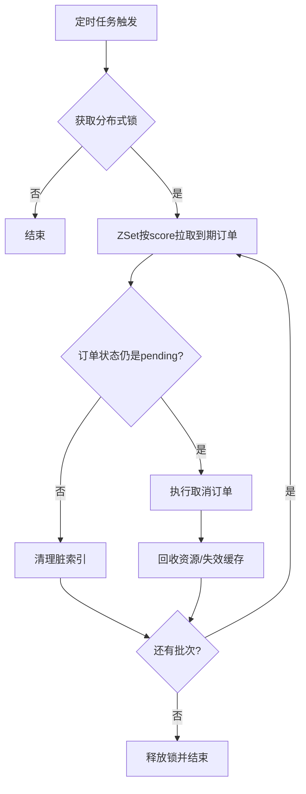
```mermaid
flowchart TD
    T[定时任务触发] --> L{获取分布式锁}
    L -- 否 --> END1[结束]
    L -- 是 --> Z[ZSet按score拉取到期订单]
    Z --> CHK{订单状态仍是pending?}
    CHK -- 否 --> CLEAN[清理脏索引]
    CHK -- 是 --> CANCEL[执行取消订单]
    CANCEL --> RECOVER[回收资源/失效缓存]
    CLEAN --> NEXT{还有批次?}
    RECOVER --> NEXT
    NEXT -- 是 --> Z
    NEXT -- 否 --> END2[释放锁并结束]
```

## 项目结构
- cozy-coffee-backend：后端微服务
- cozy-coffee-web：用户端 Web
- cozy-coffee-admin：管理后台
- cozy-coffee-mobile：移动端
- scripts：测试与运维脚本

## 快速启动（本地开发）
### 1. 环境准备
- JDK 17+
- Maven 3.8+
- Node.js 18+
- MySQL 8.0+
- Redis 6+
- Nacos 2.x

### 2. 初始化
- 导入数据库脚本（member/order/mall 等）
- 启动 Redis 与 MySQL
- 启动 Nacos（默认 8848）

### 3. 启动后端（建议顺序）
1. cozy-common / cozy-api（依赖模块）
2. provider 服务（user/member/order/mall）
3. cozy-gateway

### 4. 启动前端
- 用户端：cozy-coffee-web
- 管理端：cozy-coffee-admin

### 5. 访问地址（按本地配置调整）
- Gateway API: http://localhost:8080
- 用户端: http://localhost:5173
- 管理端: http://localhost:5174

## Docker 部署（可选）
建议提供 docker-compose.yml，包含 mysql、redis、nacos、gateway、providers。

## API 示例
- GET /api/order/products：获取菜单
- POST /api/order/create：创建订单
- POST /api/member/signin：签到
- GET /api/admin/orders/recent：管理端最近订单

## 压测说明
- 工具：Locust
- 场景：高频读 + 下单混合压测
- 并发：500
- 指标：QPS、平均RT、P95/P99、错误率

## 前端界面预览

### 用户端核心流程（Web/Mobile）
目标：展示从浏览商品到完成下单的完整体验链路。

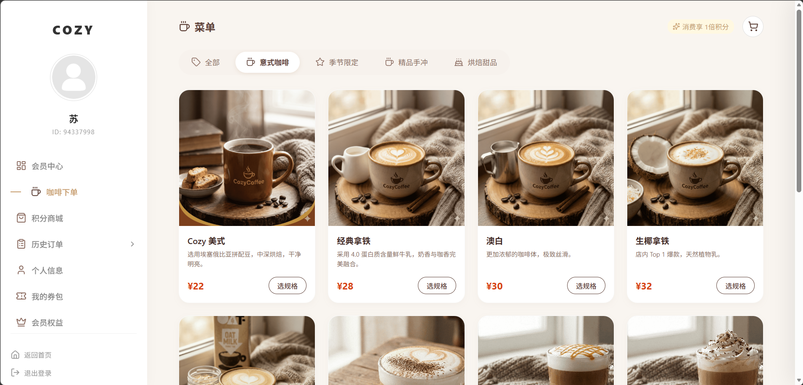
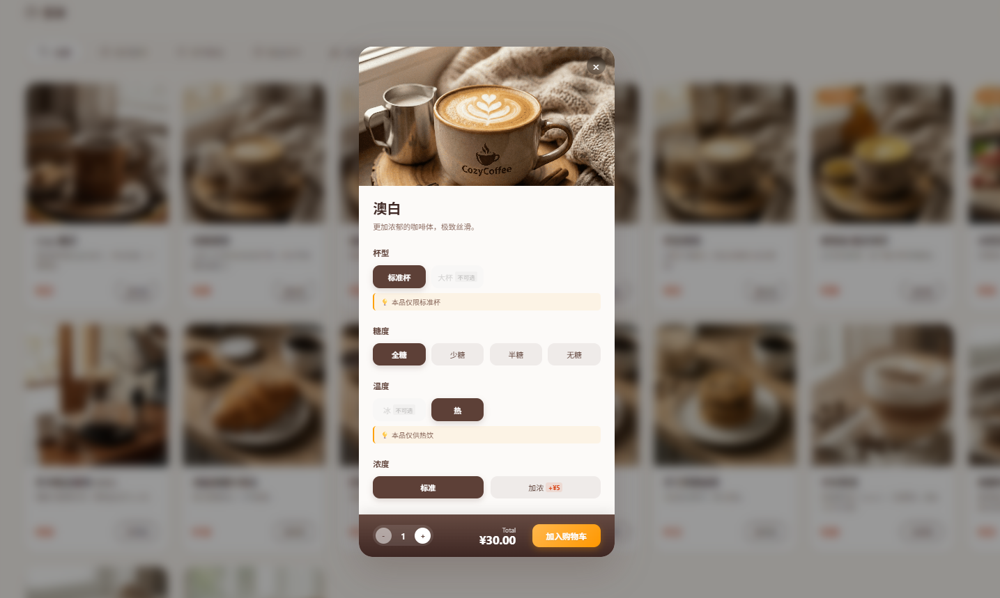
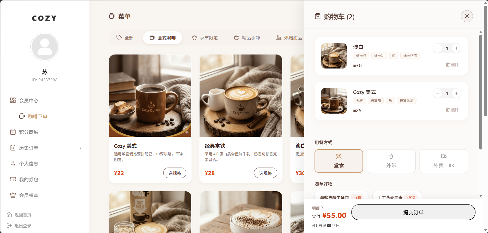
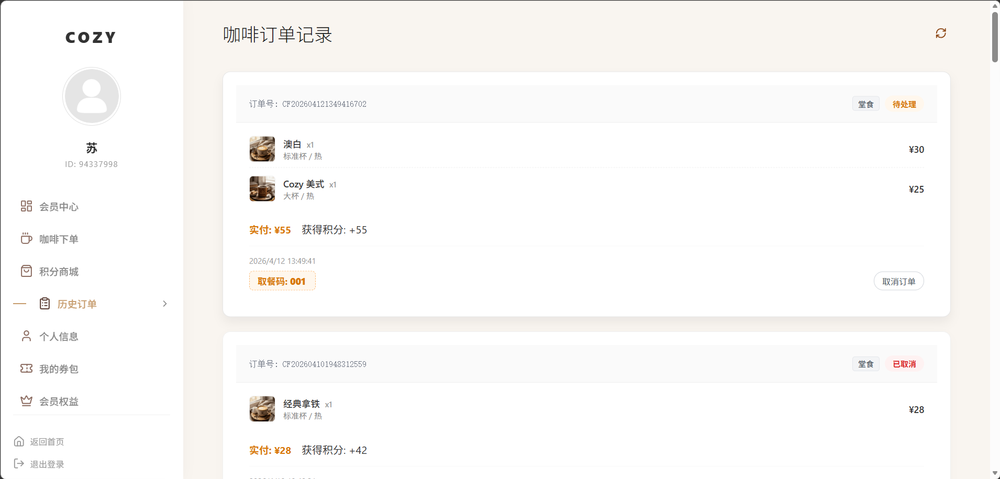

### 会员与营销体验
目标：展示会员等级、积分、签到、优惠券规则在前端的实际呈现。

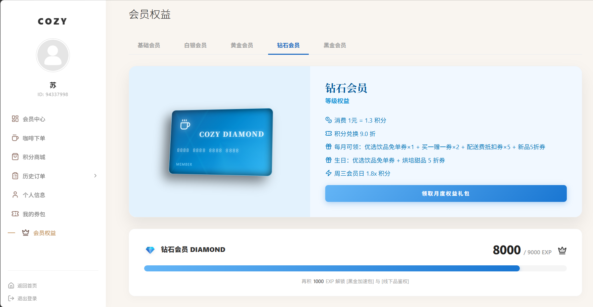

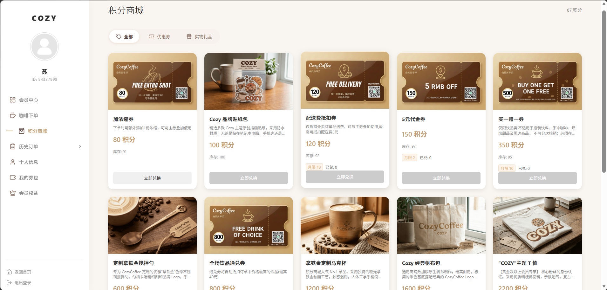
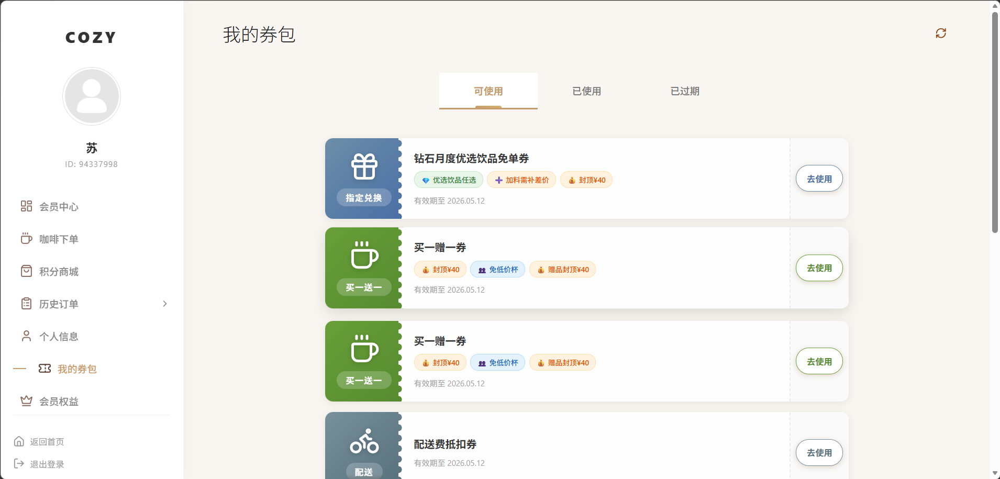
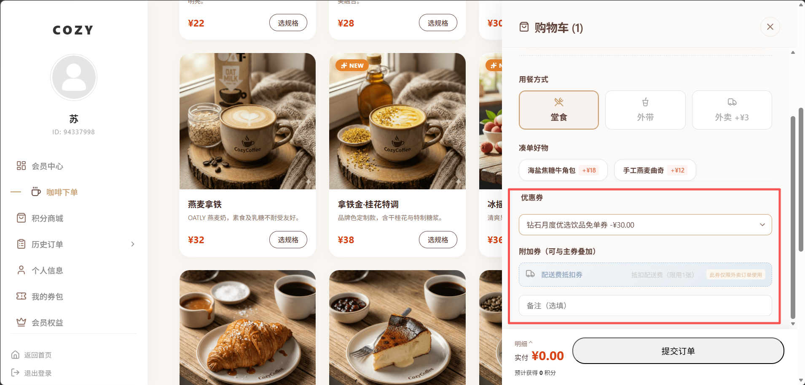

### 管理后台运营视图
目标：展示后台实时订单处理与经营分析能力。

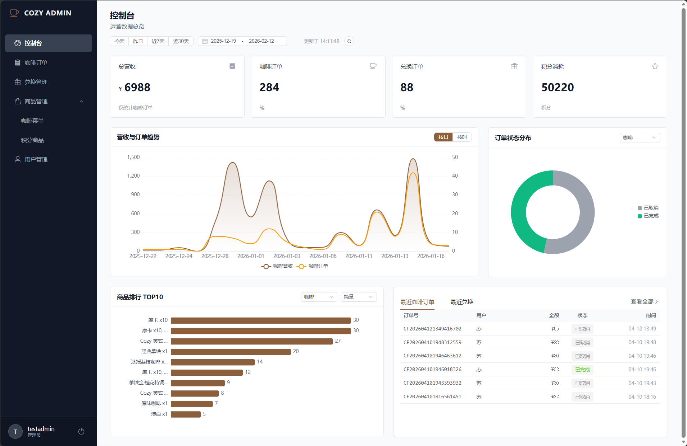
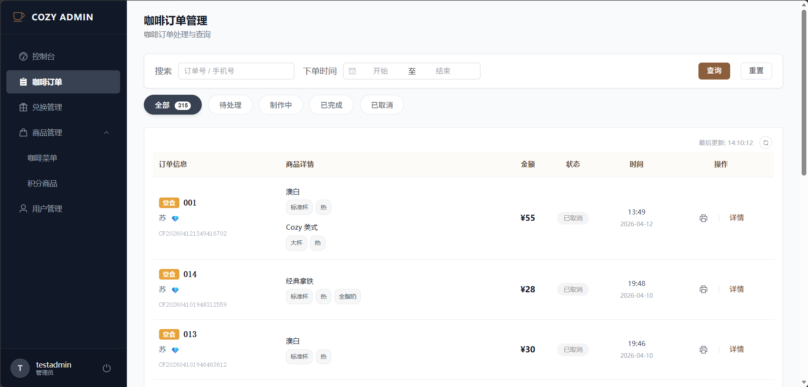
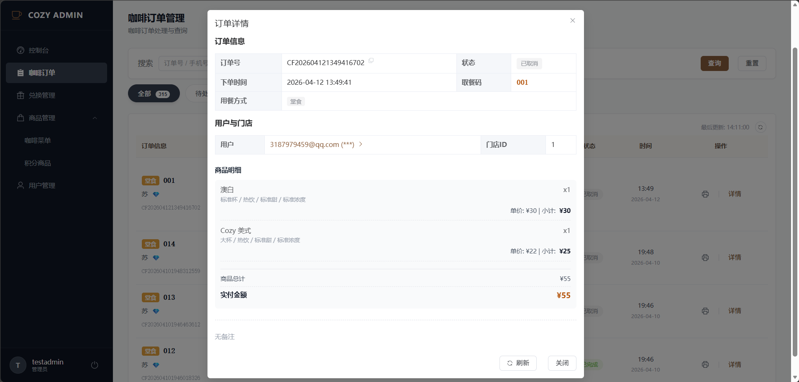
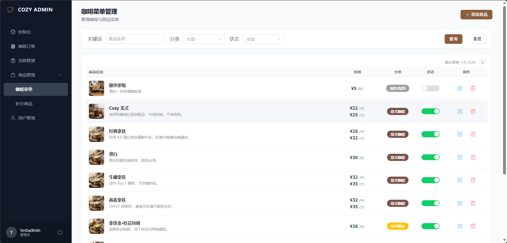
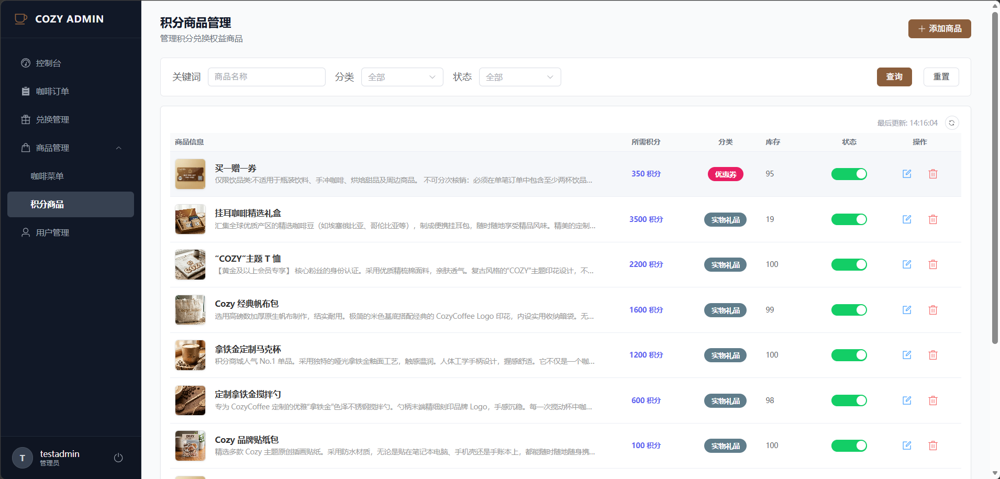
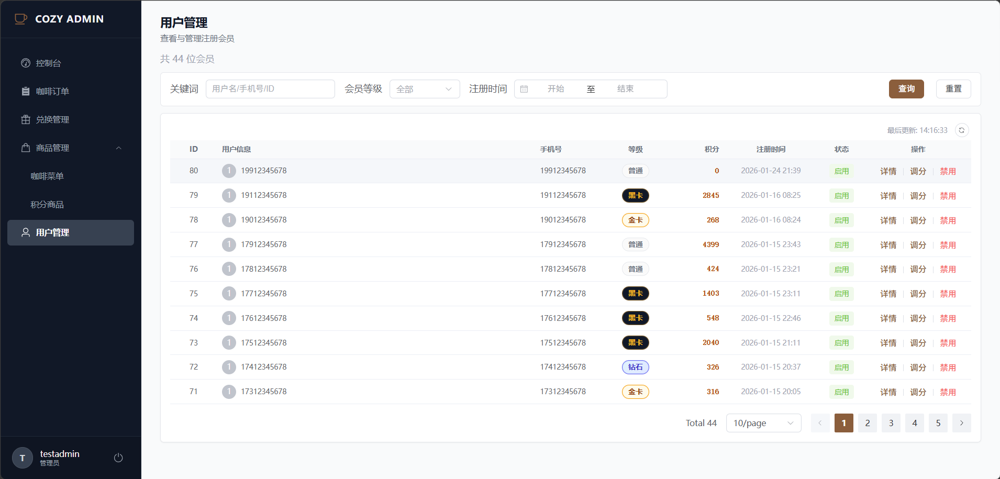
### 压测与可视化证据
目标：展示性能优化的结果证据。

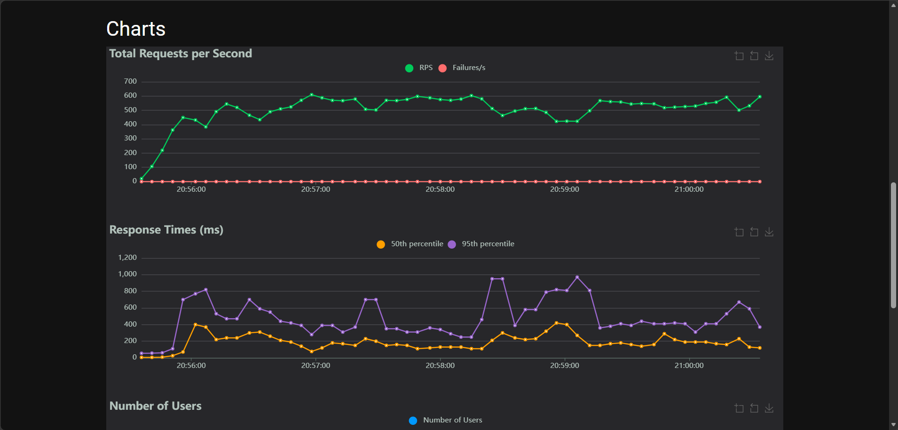

## 项目截图说明
- 图片命名与目录规范见 [docs/images/README.md](docs/images/README.md)
- 建议优先补齐“用户端核心流程 + 管理后台看板 + 压测结果”三组图片
- 所有截图请先做隐私脱敏（手机号、地址、token、订单号）

## 已知限制与后续计划
- 当前以单地域部署为主，后续可扩展多实例弹性部署
- 计划补充 CI/CD 与自动化回归测试
- 计划完善可观测性（指标、链路、告警）

## 作者
- Name: 你的名字
- Email: 你的邮箱
- GitHub: 你的仓库链接
