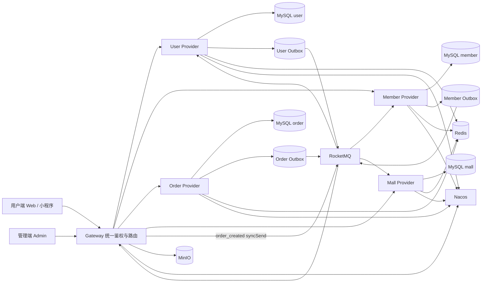
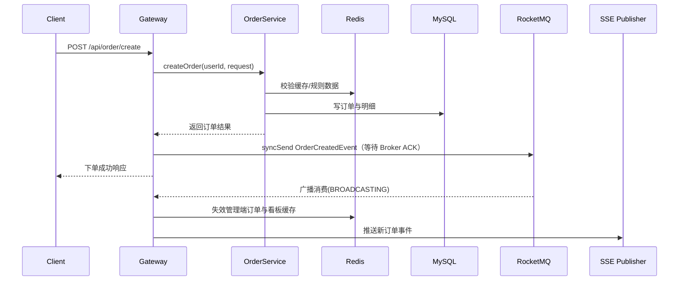
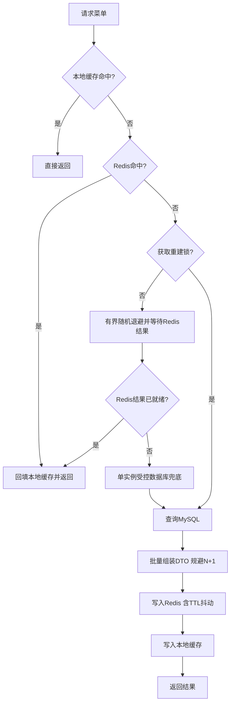
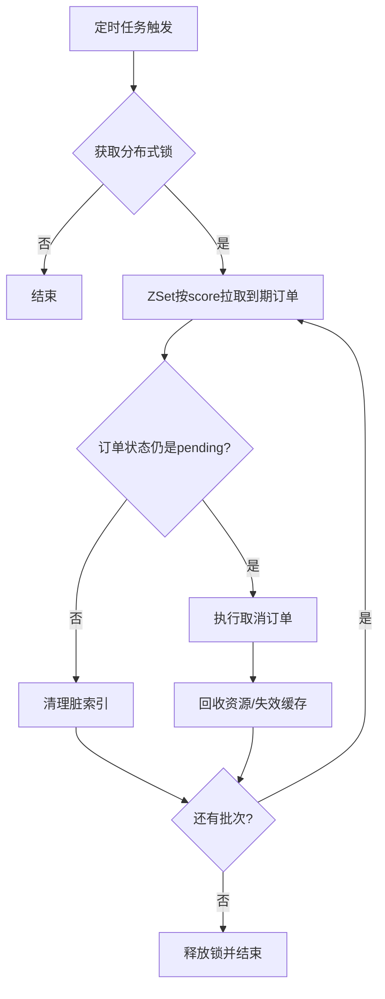

<div align="center">

# CozyCoffee

### 咖啡新零售全链路 · 点单履约 × 会员运营 × 精品咖啡小程序


**咖啡点单与会员运营全链路｜Web + 微信小程序 + 管理端三端｜RocketMQ 事件驱动一致性｜可复核的性能与并发验证**

</div>

---
## 项目简介
CozyCoffee 是个人独立开发的咖啡零售微服务项目，覆盖商品点单、订单履约、会员积分、优惠券与运营管理，交付 **Web 用户端、微信小程序、运营管理端** 三端。后端由 **User / Member / Order / Mall 四个领域 Provider 与 Gateway** 组成，各域独立数据库。项目重点实践跨服务权益发放的可靠性、领域依赖治理、菜单查询优化，以及基于真实基础设施的集成验证。

## 目录
- [项目简介](#项目简介) · [核心亮点](#核心亮点) · [技术栈](#技术栈)
- [系统架构图](#系统架构图) · [事件驱动与最终一致性](#事件驱动与最终一致性)
- [下单时序图](#下单时序图) · [缓存策略图](#缓存策略图) · [订单超时取消图](#订单超时取消图)
- [项目结构](#项目结构) · [运行方式](#运行方式)（[日常开发](#日常开发) / [隔离 API E2E](#隔离-api-e2e) / [生产部署](#生产部署)）
- [测试与 CI](#测试与-ci) · [压测说明](#压测说明) · [前端界面预览](#前端界面预览) · [作者](#作者)

## 核心亮点
- **领域边界与依赖治理**：User / Member / Order / Mall 四 Provider 各自独立数据库（cozy_user / member / order / mall），Dubbo 3.2 + Nacos 2.2 完成 RPC 与服务发现；Gateway 统一鉴权、**BFF 聚合**（会员资料与券包数量在网关一次批量组合，消除逐用户 RPC）与 SSE 推送。已删除 `user → member/mall`、`mall → order` 的依赖，并用 Maven Enforcer 禁令锁死防止回流
- **可靠事件与最终一致性**：把用户侧 **7 个跨域写调用点收敛为 5 类生命周期事件**，业务变更与 **Outbox** 在同一本地事务提交，提交后尝试发送、失败由 Relay 退避重试；Member 发券用独立 Outbox；消费端结合业务幂等键、数据库唯一约束与条件更新处理重复消息。可靠性口径是**至少一次投递 + 消费幂等**（见[事件章节](#事件驱动与最终一致性)）
- **菜单查询优化**：批量预加载加料组、咖啡豆与拼配档案，消除 DTO 转换 N+1；31 个商品数据集下，一次完整菜单重建的 SQL 从 **77 条降至 6 条**
- **验证与持续交付**：源码含 **300+ JUnit 测试方法**与 **40 个 Flyway 迁移**；CI 跑不依赖本地基础设施的后端测试与三端 Vitest，测试通过后构建并推送镜像；生产用脚本按 commit SHA 发布，配合就绪检查、版本回退与部署后 Outbox 巡检
- **会员与积分体系**：EXP / 积分双账户、五级成长与等级特权、FIFO 先到期先消耗；签到 / 月度挑战 / 生日 / 首单 / 邀请 / 晋升礼等奖励规则全部 `@ConfigurationProperties` 配置化——改 yml 即可调整策略
- **优惠券与商品体系**：发券模板 + 抵扣策略（`CouponCalculator` 按 9 类券分发）+ L1 主券 / L2 辅券组合引擎；V2 商品统一规格校验与定价（杯型 / 出品方式）、加料组权威解析、咖啡内容层数据驱动，三端同源
- **Redis 与并发治理**：字符串缓存（本地 + Redis 多级、空值缓存、TTL 抖动、SingleFlight、重建锁）；Bitmap 记签到、ZSet 管订单超时队列；配合分布式锁、CAS 乐观锁（防超卖 / 防重复发放）与订单状态机兜底
- **性能与并发验证**：k6 在隔离环境多轮 A/B；菜单接口 200 RPS 连续 3 轮无失败或丢弃，冷缓存 200 并发连续 3 轮均返回有效菜单且每轮只重建 1 次（**单实例并发正确性验证**，非多实例故障注入）

## 技术栈
| 层 | 技术 |
|---|---|
| 后端 | Java 17 · Spring Boot 3.4 · Dubbo 3.2 · Nacos 2.2 · RocketMQ 5.3 · MyBatis-Plus 3.5 · Flyway 数据库迁移 |
| 数据与缓存 | MySQL 8.0 · Redis 7 · MinIO 对象存储（S3 兼容，部署使用；本地开发走本地文件） |
| 前端 | Vue 3（Web / Admin）· uni-app 微信小程序 · Element Plus · Pinia |
| 工程与质量 | Maven · JUnit 5 / Vitest · GitHub Actions CI · k6 压测 |

## 系统架构图


> 三条写入路径各不相同：订单完成 / 取消在订单事务内写 **Order Outbox**、由 Relay 投递；用户生命周期事件写 **User Outbox**；Member 发券请求写 **Member Outbox**。`order_created` 则由 Gateway 直接 `syncSend` 并等待 Broker ACK 后返回 —— 这条**刻意不走 Outbox**，因为下单响应需要立即知道 Broker 已接收。SSE 推送与管理端缓存失效由消费者异步处理。

## 事件驱动与最终一致性
系统有**四条**消息路径，触发方式与可靠性语义各不相同，不要一概而论：

**① 订单事实事件（Order Outbox）** —— `order_completed` / `order_cancelled` 与业务状态在同一事务内写入 `message_outbox`，由定时 Relay 扫描投递（退避重试）。消费端做积分 / EXP / 首单 / 月度任务；券回滚走 Inbox 按事件 ID 去重。

**② 用户生命周期事件（User Outbox）** —— 注册建档、新人券、完善资料、生日、邀请奖励这 **7 个跨域写调用点**收敛为 **5 类事件**，业务变更与 Outbox 在同一本地事务提交，Relay 退避重试。**奖励规则归消费域持有**（改规则不动生产者）。

**③ Member 发券请求（Member Outbox）** —— 发券请求持久化到 `coupon_grant_outbox`，Member 不再同步调用 Mall API，并暴露待投递 / 失败 / 滞留指标。

**④ 订单创建（Gateway 同步投递）** —— `order_created` 由 Gateway `syncSend` 投递并等待 Broker ACK 后返回；SSE 广播与管理端缓存失效由消费者异步处理。**这条刻意不走 Outbox。**

```
cozy-order-events
 ├── order_created   → Gateway syncSend → SSE 广播 + 管理端缓存失效      (BROADCASTING)
 ├── order_completed → Order Outbox → 积分 / EXP / 首单 / 月度任务       (CLUSTERING)
 │                    → user 认领邀请资格（cozy-user-invite-reward）    (CLUSTERING)
 │                    → gateway SSE 完成通知                           (BROADCASTING)
 └── order_cancelled → Order Outbox → mall 券回滚（Inbox 去重）          (CLUSTERING)

cozy-user-events
 ├── user_created           → member 建档（唯一键吸收重复）
 ├── welcome_gift_eligible  → mall 发新人券
 ├── profile_completed      → member 完善资料积分
 ├── birthday_set           → member 生日权益 + mall 生日券
 └── invite_reward_earned   → mall 发邀请券

Member 发券请求      ：coupon_grant_outbox（本地 Outbox → Relay）
积分退款 / 兑换回滚补偿：points_refund_outbox（本地 Outbox → 定时 relay）
```

> **可靠性口径**：以上均为**至少一次投递 + 消费端幂等**（业务幂等键 / 数据库唯一约束 / 条件更新）。
> Outbox 的 `SENT` 只代表**生产端发送完成**，不等于消费端业务已执行成功；重试耗尽进入 `DEAD` 需人工重放
> （`deploy/check-health.sh` 在部署后巡检 `DEAD` 与滞留的 `PENDING`）。**不承诺 exactly-once。**

## 下单时序图


> 说明：下单响应会等待 `ORDER_CREATED` 获得 Broker ACK，但不会等待 SSE 广播与缓存失效等消费端逻辑完成；`ORDER_COMPLETED` 和 `ORDER_CANCELLED` 由 Order Provider 在事务内写入 Outbox，分别触发积分、成长值、首单、月度任务和优惠券回滚。

## 缓存策略图


## 订单超时取消图


## 项目结构
- cozy-coffee-backend：后端微服务（cozy-common / cozy-api / cozy-provider / cozy-gateway）
- cozy-coffee-web：用户端 Web（Vue 3）
- cozy-coffee-mobile：微信小程序（uni-app）+ 可点击 HTML 原型
- cozy-coffee-admin：运营管理后台（Vue 3 + Element Plus）
- scripts：测试与运维脚本（`perf/` 压测、`e2e-user-events.sh` 隔离 E2E）
- deploy：生产发布与巡检脚本（`deploy.sh` / `rollback.sh` / `check-health.sh`）

## 运行方式

### 日常开发
`docker-compose.yml` 默认只拉起基础设施（MySQL、Redis、Nacos、RocketMQ 和 MinIO），4 个 Provider 与 Gateway 在 IDE 本地运行，Web 与管理端可选择 Docker 或本地 `npm run dev`。需要全链路 Docker 验证时，取消 `cozy-*-provider` / `cozy-gateway` 服务注释后执行 `docker compose up -d --build`。

```bash
docker compose up -d          # 只起基础设施，其余在 IDE 里跑
```

本地访问：
- Gateway API: http://localhost:8080
- 用户端 Web: http://localhost:5173
- 管理端: http://localhost:5174

### 隔离 API E2E
`scripts/e2e-user-events.sh` 用**独立 Compose project 与 volume**（不污染日常开发库）起真实基础设施与 4 个 Provider + Gateway，全程走**真实 API**（SQL 只用于断言与环境准备），验证注册、下单、权益发放、消息重放与会话撤销。

- 覆盖 **15 个验收步骤**，含 topic / consumer group 门禁（**先等心跳再断言**，不固定 sleep）
- 商家提醒链路真挂一条管理端 SSE：断言**下单只清缓存不推** `new_order`、**付款才推**（推送内容带本单订单号）
- **成功即清理环境**（`down -v`），**失败保留现场**并把各容器日志收进临时目录
- 与日常 dev 栈同时跑会抢本机资源，脚本自带冲突守卫；确认要并行时加 `--force`
- **不在 CI 里**：它需要真实基础设施、跑一次成本高，由人工在改事件链路后触发

```bash
docker compose stop                   # 先停掉日常 dev 栈（只停不删卷）
bash scripts/e2e-user-events.sh
```

### 生产部署
生产是**脚本化发布**，不是"推代码即自动部署"：

1. **CI（GitHub Actions）** 在测试通过后构建 7 个镜像（4 Provider + Gateway + Web + Admin）推送到 ACR，tag = **commit SHA**（全 SHA 与短 SHA 双 tag）
2. 在服务器上按 SHA 发布：`pull` → `up -d --wait` 就绪检查，成功后轮转版本记录
3. 部署后用 `check-health.sh` 巡检容器状态与三张 Outbox 表

```bash
ssh cozy 'cd /opt/cozycoffee/deploy && ./deploy.sh <git-sha>'   # 发布
ssh cozy 'cd /opt/cozycoffee/deploy && ./rollback.sh'           # 回退到上一成功版本
ssh cozy 'bash /opt/cozycoffee/deploy/check-health.sh'          # 部署后巡检
```

> `check-health.sh` 对 `DEAD > 0` 与滞留超 `600s` 的 `PENDING` 判异常，是**部署后手工巡检**——
> 当前既不是自动告警平台，也**未被发布脚本自动调用**。`DEAD > 0` 意味着券或积分**静默没发**，必须人工重放。
>
> ⚠️ **回滚是镜像级的**：Flyway 已执行的迁移**不会**回退，因此迁移必须**向后兼容**（只加列 / 加表，
> 不删改旧镜像仍在用的列），否则旧镜像可能启动失败。2C8G 上 5 个 JVM 冷启动约 3.6~7.8 分钟属正常。

## 测试与 CI
- **后端**：50 个测试类、**300+ JUnit 5 测试方法**，覆盖订单状态机、定价与加料、优惠券计算与组合、用券下单、取消回滚、奖励发放、积分一致性，以及菜单缓存并发与 DTO 批量转换两个回归
- **数据库迁移**：40 个 Flyway 脚本（User 3 / Member 4 / Order 26 / Mall 7）—— 四个服务的迁移量之和，不是单库版本号
- **前端**：Web / 小程序 / 管理端 Vitest 单测
- **CI（GitHub Actions）**：JDK 17 + `mvn test` + 三端前端测试矩阵，自动判败
- **隔离 API E2E（独立入口，不在 CI）**：`scripts/e2e-user-events.sh` 的 15 个验收步骤，见[运行方式](#隔离-api-e2e)

> CI 为不引入外部依赖，**排除 6 个需要真实基础设施（MySQL / Redis / Nacos / RocketMQ）的集成测试类**，
> 因此 CI 跑的**不是全量测试**，那部分由隔离 E2E 承接。测试方法数来自源码静态统计（行首 `@Test`），
> 不是某次运行的通过报告。

## 压测说明
- **工具与模型**：k6 1.5.0；稳态测试使用固定到达率开放模型，突发测试使用并发 VU
- **环境隔离**：专用 Nacos、RocketMQ、MySQL Schema 和 Redis DB；Gateway、Order Provider 各限制为 1 CPU / 512 MiB
- **统计口径**：正式 A/B 使用 5 轮中位数，容量与突发测试使用 3 轮中位数；不取单轮最好成绩

### 菜单缓存 A/B

该组测试完成于 DTO N+1 修复前；对照双方使用相同代码、数据和容器资源（数据集为 **31 个商品**），仅切换 DB 直读与本地缓存 + Redis 模式。测试负载为 20 RPS、60 秒/轮，各运行 5 轮。

| 模式 | 平均响应时间中位数 | P95 中位数 | P99 中位数 | HTTP 失败 | 丢弃迭代 |
|---|---:|---:|---:|---:|---:|
| DB 直读 | 40.879 ms | 64.610 ms | 90.488 ms | 0 | 0 |
| 本地缓存 + Redis | 3.956 ms | 5.909 ms | 8.005 ms | 0 | 0 |

缓存模式下平均响应时间降低 **90.32%**，P99 降低 **91.15%**。在 200 RPS 下连续运行 3 轮，共完成 36,003 次请求，P95 / P99 中位数为 3.991 / 7.499 ms，无失败或丢弃。

### DTO N+1 优化

使用 DB 直读模式按相同的 20 RPS、60 秒、5 轮口径复测，避免缓存命中掩盖查询成本。

| 指标 | 优化前 | 优化后 | 变化 |
|---|---:|---:|---:|
| 完整菜单重建 SQL | 77 | 6 | -92.21% |
| 平均响应时间中位数 | 40.879 ms | 10.389 ms | -74.59% |
| P95 中位数 | 64.610 ms | 15.938 ms | -75.33% |
| P99 中位数 | 90.488 ms | 22.614 ms | -75.01% |
| 5 轮 MySQL 语句数中位数 | 92,473 | 7,208 | -92.21% |

### 冷缓存与下单正确性

- 冷缓存 200 并发连续 3 轮均为 200/200 非空、0 HTTP 错误、0 业务错误，每轮只记录 1 次缓存更新和 6 条 SQL。这是**单 Order Provider 实例**的并发正确性验证（SingleFlight 合并重建），**不是多实例故障注入**，也不代表毫秒级突发响应。
- 完整“购物车预览 → 创建订单 → RocketMQ 发布”链路以 5 个工作流/秒运行 5 轮，共创建并落库 1,503 笔订单，0 业务失败、0 丢弃；创建订单 P95 / P99 中位数为 54.806 / 61.857 ms。
- 50 个并发请求使用同一个幂等键创建订单时，1 次首次创建、49 次幂等重放，数据库只生成 1 笔订单。

> 上述数据用于说明当前本地隔离环境下的优化效果与并发正确性，不代表线上容量上限。

### 复现材料

隔离环境编排、测试开关补丁、汇总结果与完整报告都在 [`scripts/perf/archive/`](scripts/perf/archive/)，含
`environment-manifest.json` 记录的资源与版本口径。**每轮的原始日志（应用日志、容器指标、MySQL / Redis
快照）未随仓库发布**，因此这里的主张是**可复核**（口径、负载、轮数与汇总原始件齐全，可照着重跑），
而非"克隆即可一键复现同一组数"。

## 前端界面预览

按端折叠，**点击下方标题展开查看**：

<details>
<summary><b>用户端首页（Web）</b> —— 品牌叙事 / 产区 / 菜单 / 会员内容</summary>


</details>

<details>
<summary><b>用户端核心流程（Web）</b> —— 从浏览商品到完成下单</summary>


</details>

<details>
<summary><b>积分与优惠（Web）</b> —— 积分商城 / 积分获取 / 券包</summary>


</details>

<details>
<summary><b>会员中心（Web）</b> —— 会员中心 / 个人信息 / 权益</summary>


</details>

<details>
<summary><b>管理后台运营视图</b> —— 实时订单处理与经营分析</summary>


</details>

<details>
<summary><b>小程序端（uni-app）</b> —— 点单 / 会员 / 订单链路</summary>

品牌叙事首页 → 产区探索 → 菜单点单 → 选规格 → 结算 → 订单 → 积分商城 → 会员运营。

<p align="center">
  
  
  
  
</p>
<p align="center">
  
  
  
  
</p>
<p align="center">
  
  
  
  
</p>
<p align="center">
  
  
  
  
</p>
<p align="center">
  
  
  
</p>

</details>

## 作者
- Name: 苏瑞鑫
- Email: 3187979459@qq.com
- GitHub: https://github.com/Lstarxing
