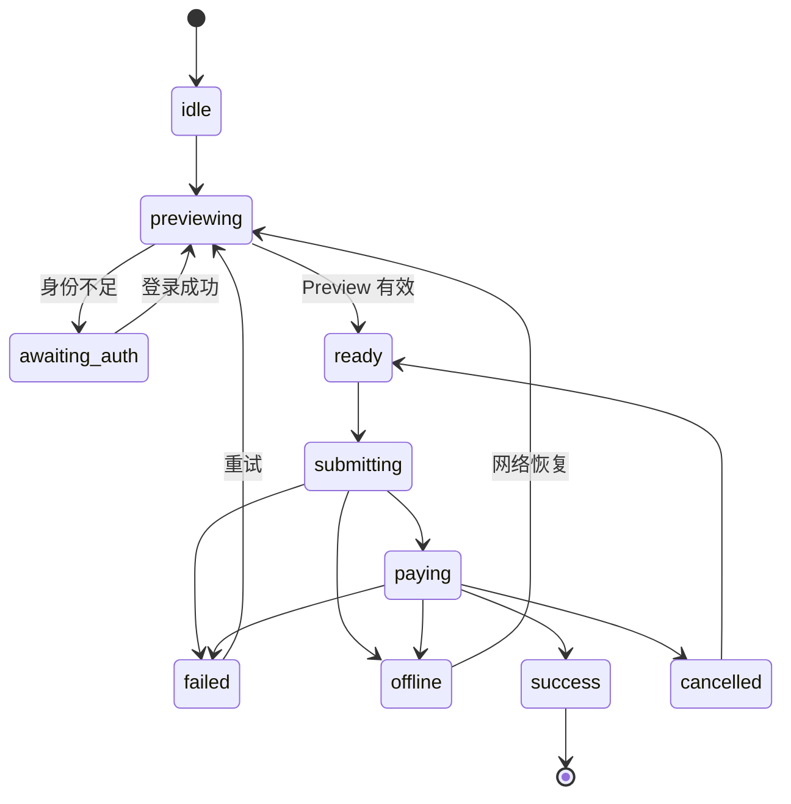

# CozyCoffee 移动端核心自提点单链路设计

日期：2026-07-14  
目标项目：`cozy-coffee-mobile`  
优先平台：微信小程序；同时保持 H5 与 App 可移植性
状态：Frozen（技术评审通过，可进入实施计划）

## 1. 背景与目标

当前移动端采用 Vue 3、uni-app、Pinia 和 Sass，已有首页、菜单、商品详情、购物车、确认订单、订单列表、会员、积分商城等页面。H5 可以编译，但核心链路仍存在以下风险：

- 业务范围过大，点单、外卖、优惠券、积分、签到、商城同时演进。
- `pages/order/confirm.vue` 集中处理接口、价格、优惠、地址、配送与提交，职责过多。
- 购物车按商品 ID 合并，无法可靠区分同一商品的不同规格。
- 请求层会把部分业务失败作为成功结果返回，页面容易漏判。
- 非 H5 环境使用 `localhost` 作为 API 地址，真机无法访问开发机后端。
- 模拟支付、登录恢复、幂等、离线状态和商品重新校验尚未形成统一规范。

第一阶段采用“核心链路纵向重构”，只完成一条稳定、可测试、可扩展的固定门店自提链路：

```text
静默会话
→ 浏览菜单
→ 选择商品规格
→ 加入购物车
→ 确认固定门店自提订单
→ 模拟支付
→ 查看订单结果与详情
```

## 2. 范围

### 2.1 第一阶段包含

- 微信小程序启动时建立静默会话。
- 未完成正式身份绑定的用户可以浏览菜单和编辑购物车。
- 提交订单前完成身份检查与登录恢复。
- 单一固定门店，展示门店名称、地址、营业状态和预计取餐时间。
- 菜单分类、商品列表、搜索入口和规格选择。
- 购物车增加、减少、删除、编辑规格和本地持久化。
- 确认订单、价格预览、备注、后端已稳定支持的优惠类型。
- 模拟支付、订单创建、结果页、订单详情与取餐信息。
- 加载、空数据、离线、失败重试、登录过期和商品失效状态。
- H5 与微信小程序编译验证，以及微信真机网络验证。

### 2.2 第一阶段不包含

- 真实微信支付。
- 多门店选择、定位、距离计算和跨店购物车。
- 外卖地址、配送范围与配送费。
- 积分商城、签到、会员权益等非核心页面的重构。
- 复杂促销叠加、积分抵扣和营销规则引擎。

现有非核心页面可以保留，但不得阻塞核心链路交付。“附近门店”等当前无后端支持的入口应从主链路移除或显示为未开放。

## 3. 产品与视觉方向

采用“高效点单”方向：熟悉、直接、低学习成本，接近成熟连锁咖啡应用的任务型界面。

- 使用系统无衬线字体和紧凑、稳定的字号层级。
- 菜单与操作效率优先，品牌棕只用于主操作、选中状态和关键提示。
- 不用装饰性渐变、玻璃拟态、夸张圆角或无意义动效。
- 动效只用于状态反馈，常规时长为 150–250ms，并支持减少动态效果。
- 同类按钮、选择器、价格、空状态和错误状态在所有核心页面中保持一致。

## 4. 用户流程

### 4.1 会话与登录

1. 微信小程序启动时调用微信登录能力，由后端建立静默会话。
2. 用户可以在未完成正式身份绑定时浏览菜单、选择规格和编辑购物车。
3. 用户进入结算或提交订单时检查账户是否满足下单要求。
4. 若需要登录或绑定，保存当前结算意图并进入身份恢复流程。
5. 登录成功后重新生成价格预览，再恢复结算；购物车不得丢失。
6. H5 与 App 使用账号密码等平台适配登录方式，但页面消费统一的会话接口。

### 4.2 菜单与规格

- 菜单页是核心工作台，采用左侧分类、右侧商品列表。
- 顶部显示固定门店、营业状态、预计取餐时长和搜索入口。
- 简单商品可以直接加购；需要选择规格的商品打开底部规格面板。
- 规格面板至少覆盖杯型、温度、糖度、奶类型和咖啡浓度中该商品支持的选项。
- 用户无需离开菜单页即可完成规格选择。
- 独立商品详情页不属于核心点单必经路径，可保留用于展示更多内容。

### 4.3 购物车

- 底部购物车条持续显示件数、总价和主操作。
- 同一商品的不同规格必须作为不同条目展示。
- 用户可以在购物车中重新打开规格面板编辑条目。
- 数量减少到零时删除条目，并提供短暂撤销机会。
- 购物车写入本地存储；提交成功前不得因登录、支付取消或网络失败而清空。

### 4.4 确认订单

确认页只保留：

1. 固定自提门店与营业状态。
2. 预计取餐时间，默认“尽快取餐”。
3. 商品清单、规格、数量和单价。
4. 后端已稳定支持的优惠。
5. 订单备注。
6. 价格预览与提交操作。

确认页不展示外卖、自提切换、地址选择或多门店选择。

### 4.5 支付与结果

- 开发环境明确展示“模拟支付”，避免用户误认为发生真实扣款。
- 支付取消、失败或网络中断不清空购物车。
- 成功后展示订单号、订单状态、取餐信息和返回订单列表入口。
- 页面不感知具体支付实现，未来接入微信支付时不改变页面流程。

## 5. 前端架构

### 5.1 页面层

页面只负责：

- 组合组件。
- 接收用户操作。
- 根据状态渲染内容。
- 发起明确的业务命令。

页面不得自行实现价格分摊、规格标准化、错误分类或支付编排。

### 5.2 业务组件

第一阶段应形成以下可复用组件：

- `ProductListItem`
- `ProductSpecSheet`
- `CartBar`
- `CartSheet`
- `CartLineItem`
- `StoreSummary`
- `CheckoutPriceSummary`
- `CheckoutSubmitBar`
- `LoadingSkeleton`
- `EmptyState`
- `RetryState`
- `OfflineNotice`

组件名可以按项目现有命名习惯调整，但职责边界不得合并回大型页面。

### 5.3 Pinia Stores

#### sessionStore

负责：

- 静默会话状态。
- 正式登录与身份绑定状态。
- Token 和用户资料。
- 会话恢复与退出。

#### cartStore

负责：

- 购物车条目。
- 数量与规格变更。
- 本地持久化。
- 购物车基础小计。

购物车条目标识由统一标准化器生成：

```text
cartLineKey = "v1:" + normalize({
  productId,
  skuId,
  cupSize,
  temperature,
  sugarLevel,
  milkType,
  coffeeStrength
})
```

`skuId` 不存在时使用稳定空值。字段顺序、枚举大小写和空值必须标准化，禁止页面自行拼接 Key。

Key 必须带版本前缀。当前版本为 `v1:`；未来新增冰量等会影响价格或出品的规格字段时，升级到新版本，并提供本地购物车迁移函数。无法安全迁移的旧条目应提示用户确认后移除，不得静默合并为错误规格。

#### checkoutStore

只保存用户选择和流程状态：

```text
storeId
pickupTime
selectedCouponId
remark
checkoutStatus
idempotencyKey
```

不得缓存 `totalPrice`、`discountPrice`、`payPrice` 等派生价格。

### 5.4 Store 生命周期

- `sessionStore`：App 生命周期。应用启动时恢复，主动退出或认证失效且无法恢复时清理。
- `cartStore`：App 生命周期并持久化。订单最终成功或用户主动清空时清理；登录、支付取消、断网和进入后台不得清理。
- `checkoutStore`：Checkout 生命周期。进入结算时创建；订单成功、用户主动放弃本次结算或购物车发生实质变化时重置。进入后台时保留，返回前台后重新校验 Preview。

## 6. 价格预览与商品校验

### 6.1 第一阶段

第一阶段后端尚无 `/checkout/preview` 和 `/cart/check`，因此：

- 使用无副作用的 `computeCheckoutPreview(cart, coupon, store)` 生成客户端预览。
- 创建订单时以后端返回金额为最终结果。
- 提交前重新获取或校验商品状态、规格和价格。
- 若后端最终金额与本地预览不同，停止模拟支付并要求用户确认新价格。
- 每次 Preview 生成 `previewVersion`，提交时必须携带相同版本。

价格函数必须是纯函数，不读取或写入 Store，不触发网络请求。

第一阶段的 `previewVersion` 由规范化后的购物车、优惠、门店、自提时间、商品版本和计算规则版本生成稳定摘要。提交前如输入摘要变化，原 Preview 立即失效并重新计算。时间戳仅用于日志和过期判断，不能替代版本校验。

### 6.2 后端配套目标

后续新增：

```http
POST /cart/check
```

建议响应：

```json
{
  "changedItems": [],
  "invalidItems": [],
  "preview": {
    "subtotal": 0,
    "discount": 0,
    "payable": 0
  }
}
```

当该接口稳定后，前端 Preview 服务改用服务端结果，页面和 Store 接口保持不变。

服务端 Preview 上线后应返回不可由客户端伪造的 `previewToken` 或版本号。创建订单必须携带该 Token；服务端负责校验商品、优惠和价格版本是否仍有效。失效时返回新的 Preview，而不是按旧金额继续创建订单。

## 7. 请求与错误体系

请求层必须区分：

```text
NetworkError
BusinessError
AuthError
ValidationError
```

统一错误对象至少包含：

```ts
{
  type,
  code,
  message,
  retryable,
  details,
  cause
}
```

业务错误码使用稳定枚举，例如 `COUPON_EXPIRED`、`STORE_CLOSED`、`ITEM_OFFLINE`。页面根据 `code` 决定交互，根据 `message` 展示文案，根据 `retryable` 决定是否提供重试，不解析自然语言字符串判断业务类型。

- `NetworkError`：超时、断网、DNS 或连接失败，页面显示离线或重试状态。
- `BusinessError`：后端明确拒绝业务操作，展示可读业务信息。
- `AuthError`：Token 缺失或过期，进入会话恢复流程。
- `ValidationError`：参数、商品规格或表单无效，定位具体问题。

后端当前会以 HTTP 200 返回部分业务失败，因此请求层必须同时解析 HTTP 状态和响应业务 `code`，业务失败不得继续作为成功结果 `resolve`。

401 恢复规则：

- GET 等幂等请求登录后可以自动重试。
- 创建订单等非幂等请求只恢复结算意图，不允许无条件后台重放。
- 登录成功后重新 Preview，并使用原 `Idempotency-Key` 恢复提交。

## 8. Checkout 状态机

结算流程使用单一状态机：

```text
idle
→ previewing
→ awaiting_auth
→ ready
→ submitting
→ paying
→ success
→ failed
```

补充状态：

- `offline`
- `cancelled`



页面不得使用多个相互覆盖的 `isLoading`、`isSubmitting`、`isPaying` 布尔值表达流程。

关键转换：

- 购物车、优惠或取餐时间发生变化：进入 `previewing`。
- 身份不满足要求：进入 `awaiting_auth`。
- Preview 有效且身份满足要求：进入 `ready`。
- 发起订单编排：进入 `submitting`。
- 支付适配器开始工作：进入 `paying`。
- 订单与支付成功：进入 `success` 并清空购物车。
- 用户取消支付：进入 `cancelled`，保留购物车。
- 网络中断：进入 `offline`，恢复后重新 Preview。
- 可恢复业务失败：进入 `failed` 并提供重试。

## 9. Checkout Workflow、订单与支付服务

### 9.1 职责边界

`CheckoutWorkflow` 是轻量编排层，只负责推进状态机和协调服务，不实现订单、支付、认证或网络细节：

```text
CheckoutWorkflow
├─ preview()
├─ submit()
└─ recover()
```

独立服务：

- `CheckoutPreviewService`：生成或请求 Preview，管理 `previewVersion/previewToken`。
- `OrderService`：`create()`、`query()`、`cancel()`，封装订单 API 和幂等协议。
- `PaymentService`：选择 Payment Adapter，执行 `prepare()` 与 `pay()`。
- `SessionService`：静默会话、正式登录和认证恢复。
- `NetworkService`：网络状态和恢复通知。

退款、补单和支付查询未来进入 `PaymentService` 或专用支付领域服务，不进入 `CheckoutWorkflow`。

### 9.2 支付适配

支付接口：

```ts
interface PaymentAdapter {
  prepare(context): Promise<PaymentRequest>
  pay(request: PaymentRequest): Promise<PaymentResult>
}
```

实现：

- `MockPaymentAdapter`：第一阶段使用。
- `WechatPaymentAdapter`：未来真实支付使用。

页面调用 `CheckoutWorkflow.submit()`，不直接引用具体 Adapter。Workflow 负责按顺序协调：

1. 检查网络和状态机状态。
2. 恢复或确认身份。
3. 重新生成 Preview。
4. 获取或复用幂等 Key。
5. 按当前支付适配器要求编排订单创建与支付。
6. 处理成功、取消和失败。

真实微信支付通常需要先创建待支付订单再获取预支付参数。该差异由 `OrderService`、`PaymentService` 和 Adapter 消化，页面流程保持稳定。

## 10. 幂等与重复提交

创建订单请求统一携带：

```http
Idempotency-Key: <UUID>
```

规则：

- 一次结算意图生成一个 Key。
- 网络重试、登录恢复和支付恢复复用原 Key。
- 订单成功、购物车发生实质变化或用户主动开始新结算后生成新 Key。
- 客户端仍需禁用重复点击，但禁用按钮不能替代后端幂等。
- 后端必须持久化 Key 与订单结果，在重复请求时返回同一订单，而不是创建新订单。

后端当前未实现该协议，因此它属于核心链路配套任务。

## 11. 离线与跨端配置

- 使用 `uni.getNetworkType` 获取初始网络状态。
- 使用 `uni.onNetworkStatusChange` 监听网络变化，并在应用卸载或不再需要时解除监听。
- 离线时允许查看缓存菜单和编辑购物车，但禁止 Preview 刷新、登录和提交订单。
- 网络恢复后自动刷新必要数据并重新 Preview，不直接重放创建订单。
- API Base URL 使用 Vite/uni-app 环境文件，不在源代码中写死真机不可访问的 `localhost`：

```text
.env.development
.env.test
.env.production
```

- 统一读取 `VITE_API_BASE_URL`；代码中不得按页面或平台重复声明 Base URL。
- 微信开发环境使用可访问开发机的局域网地址或合法测试域名；生产环境使用 HTTPS 合法域名。

## 12. 推荐目录结构

```text
src/
├─ api/
│  ├─ auth.js
│  ├─ order.js
│  └─ product.js
├─ components/
│  ├─ cart/
│  ├─ checkout/
│  ├─ product/
│  └─ states/
├─ domain/
│  ├─ cart/
│  │  ├─ cartLineKey.js
│  │  └─ cartMigrations.js
│  └─ checkout/
│     ├─ checkoutMachine.js
│     └─ computeCheckoutPreview.js
├─ services/
│  ├─ checkout/CheckoutWorkflow.js
│  ├─ checkout/CheckoutPreviewService.js
│  ├─ order/OrderService.js
│  ├─ payment/PaymentService.js
│  ├─ payment/adapters/MockPaymentAdapter.js
│  ├─ payment/adapters/WechatPaymentAdapter.js
│  ├─ session/SessionService.js
│  ├─ network/NetworkService.js
│  └─ logging/Logger.js
├─ stores/
│  ├─ session.js
│  ├─ cart.js
│  └─ checkout.js
└─ pages/
```

## 13. 日志规范

核心 Checkout 事件使用统一 Logger，不在业务代码中散落 `console.log`：

```text
checkout_started
preview_succeeded
preview_failed
auth_recovery_started
order_create_started
order_create_succeeded
payment_started
payment_succeeded
payment_cancelled
checkout_failed
checkout_recovered
```

每条日志至少包含 `traceId`、`idempotencyKey`、`previewVersion`、阶段、耗时、平台和错误码。不得记录 Token、手机号、完整地址、支付凭证或其他敏感数据。开发环境输出到控制台，测试与生产环境通过 Logger Adapter 接入后续日志平台。

## 14. 页面状态与交互规范

核心页面均需具备：

- 加载骨架。
- 空数据说明和下一步操作。
- 网络或服务失败后的重试。
- 离线说明。
- 正常内容。

业务规则：

- 门店打烊时允许浏览，禁止提交，并展示营业时间。
- 商品下架、规格失效或价格变化时阻止旧数据下单。
- 提交期间主按钮禁用并立即展示反馈。
- 支付失败、取消、401 和断网不清空购物车。
- 只有订单最终成功后清空购物车并重置结算意图。

## 15. 测试策略

### 15.1 单元测试

- `cartLineKey` 标准化，包括 `milkType`、空值和枚举大小写。
- 同一商品不同规格不合并，相同规格正确合并。
- `computeCheckoutPreview` 的小计、优惠和应付金额。
- Checkout 状态机合法与非法转换。
- 错误响应到错误类型的映射。
- 幂等 Key 的生成、复用与失效规则。
- Mock Payment 成功、取消和失败结果。
- `v1:` 购物车 Key 的生成及未来迁移函数行为。
- Preview 输入变化后旧 `previewVersion` 失效。

### 15.2 组件测试

- 规格面板默认值、不可选组合与提交结果。
- 购物车条目修改规格和撤销删除。
- 结算按钮在不同状态机状态下的文案和禁用状态。
- 加载、空状态、失败、离线和正常内容切换。

### 15.3 链路测试

- 未完成正式登录时浏览、加购，结算时完成身份恢复。
- 固定门店自提订单成功提交。
- 模拟支付取消或失败后购物车保留。
- 401 恢复后重新 Preview，且不重复创建订单。
- 商品价格变化、下架或规格失效时阻止提交。
- 离线时禁止提交，恢复网络后继续结算。
- 连续快速点击提交 10 次，最终只生成 1 张订单。
- App 进入后台 5 分钟后返回，购物车和结算意图仍在；恢复网络、会话和 Preview 校验后可以继续结算。

### 15.4 构建与真机验证

- H5 构建成功。
- 微信小程序构建成功。
- 微信开发者工具完成核心链路验证。
- 至少一次微信真机局域网或测试环境验证。
- 检查安全区、底部购物车、规格面板和系统返回行为。

## 16. 性能目标

- 已有缓存时，菜单可交互时间小于 2 秒。
- 加购后的视觉反馈小于 100ms。
- 点击提交后的加载反馈小于 300ms。
- 菜单正常滚动目标为 60fps。
- 图片使用合适尺寸、懒加载与失败占位。
- 不把服务端订单完成时间小于 300ms 作为客户端硬指标；记录并观察接口实际延迟。

## 17. 第一阶段验收标准

1. 用户进入微信小程序后能够建立静默会话。
2. 用户可以浏览菜单、选择完整规格并编辑购物车。
3. 不同规格条目正确区分、计价和持久化。
4. 结算前完成身份检查，登录恢复不丢失购物车。
5. 固定门店自提订单能够通过模拟支付成功提交。
6. 支付取消、失败、401 或断网不会错误清空购物车。
7. 订单成功后展示订单号、状态和取餐信息。
8. 商品变化可以被重新校验并阻止旧价格下单。
9. 快速点击提交 10 次只产生 1 张订单。
10. H5 与微信小程序均能构建，微信真机完成核心链路验证。
11. 核心纯函数、状态机和错误映射具有自动化测试。
12. 核心页面满足约定的加载、错误、空数据、离线与性能目标。
13. App 进入后台 5 分钟后返回，能够安全恢复结算，不使用过期 Preview 直接提交。

## 18. 实施顺序约束

实现阶段必须先完成基础设施，再改页面：

1. 环境配置、统一 Logger、请求错误体系和会话接口。
2. 规格标准化、版本化购物车条目标识、迁移函数和单元测试。
3. Checkout Preview 版本、状态机、幂等协议、Workflow、OrderService 和 PaymentService。
4. 菜单、规格面板和购物车。
5. 确认订单、模拟支付、结果与详情。
6. 链路测试、微信构建和真机验证。

非核心功能不得在第一阶段中途扩大范围。
